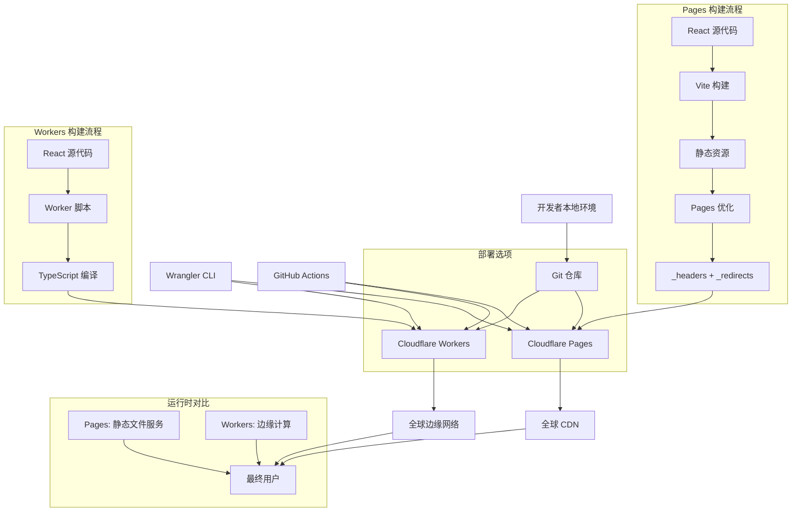

# 设计文档

## 概述

本设计文档描述了将 LLM Memory Calculator React 应用部署到 Cloudflare 的完整解决方案，提供 **双重部署选项**：Cloudflare Pages 和 Cloudflare Workers。该方案包括本地开发工具、自动化构建流程、环境配置管理、测试验证和监控设置。

### 部署选项对比

**Cloudflare Pages**：
- 静态网站托管平台，专为 JAMstack 应用设计
- 提供 Git 集成、自动构建、预览环境和全球 CDN
- 适用于纯前端 React 应用，简单易用，免费额度高

**Cloudflare Workers**：
- 无服务器计算平台，运行在全球边缘网络
- 支持动态内容生成、API 处理和复杂应用逻辑
- 适用于需要服务端功能的应用，提供边缘计算能力

本设计采用**灵活架构**，允许开发者根据需求选择最适合的部署方式，或同时使用两种方式进行 A/B 测试。

## 架构

### 双重部署架构图



### 技术栈

#### 核心技术
- **部署平台**: Cloudflare Pages + Cloudflare Workers
- **构建工具**: Vite (React 应用构建)
- **CLI 工具**: Wrangler CLI (统一部署工具)
- **TypeScript**: 完整类型支持
- **配置管理**: TOML 配置文件

#### Pages 技术栈
- **静态托管**: Cloudflare Pages
- **构建优化**: 自定义构建脚本
- **路由处理**: _redirects 文件 (SPA 支持)
- **缓存策略**: _headers 文件
- **Git 集成**: 自动构建和部署

#### Workers 技术栈
- **计算平台**: Cloudflare Workers
- **运行时**: V8 JavaScript 引擎
- **API 框架**: 原生 Workers API
- **请求处理**: Fetch API
- **边缘存储**: 可扩展 KV、D1 等

#### 开发工具
- **本地开发**: Wrangler Dev Server
- **测试工具**: 自定义测试脚本
- **CI/CD**: GitHub Actions (可选)
- **监控**: Cloudflare Analytics + Workers Analytics

## 组件和接口

### 1. Pages 配置组件

**文件**: `pages.toml`
- 配置 Cloudflare Pages 项目设置
- 定义构建命令和输出目录
- 设置多环境变量和路由规则

**接口**:
```toml
name = "llm-memory-calculator"

[build]
command = "npm run build"
destination = "dist"

[env.production]
NODE_ENV = "production"
VITE_APP_TITLE = "LLM Memory Calculator"

[env.preview]
NODE_ENV = "development"
VITE_APP_TITLE = "LLM Memory Calculator (Preview)"

[[redirects]]
from = "/*"
to = "/index.html"
status = 200
```

### 2. Workers 配置组件

**文件**: `wrangler.toml`
- 配置 Cloudflare Workers 项目设置
- 定义 Worker 脚本入口和资源
- 设置环境变量和路由规则

**接口**:
```toml
name = "llm-memory-calculator"
main = "src/worker.ts"
compatibility_date = "2024-01-15"

[vars]
NODE_ENV = "production"

[[routes]]
pattern = "your-domain.com/*"
zone_name = "your-domain.com"
```

### 3. Worker 脚本组件

**文件**: `src/worker.ts`
- Worker 入口点和请求处理
- 静态资源服务逻辑
- 路由和中间件配置

**接口**:
```typescript
interface WorkerRequest extends Request {
  cf?: IncomingRequestCfProperties;
}

interface WorkerResponse extends Response {
  headers: Headers;
}

interface AssetManifest {
  [key: string]: string;
}

export default {
  async fetch(request: WorkerRequest, env: Env): Promise<WorkerResponse> {
    // Worker 处理逻辑
  }
}
```

### 4. Pages 构建组件

**文件**: `scripts/build-pages.cjs`
- Pages 专用构建脚本
- 生成 _headers 和 _redirects 文件
- 构建信息追踪和优化

**接口**:
```javascript
interface PagesBuildConfig {
  cleanDist: boolean;
  generateHeaders: boolean;
  generateRedirects: boolean;
  buildInfo: boolean;
}

interface PagesBuildResult {
  success: boolean;
  buildTime: string;
  fileCount: number;
  outputDir: string;
  optimizations: string[];
}
```

### 5. 资源处理组件

**文件**: `src/assets.ts`
- 静态资源管理和服务
- 缓存策略实现
- MIME 类型处理

**接口**:
```typescript
interface AssetHandler {
  getAsset(path: string): Promise<Response | null>;
  getCacheHeaders(path: string): Headers;
  getMimeType(path: string): string;
}
```

### 6. 环境配置组件

**文件**: `.env.production`
- 生产环境变量配置
- API 端点和功能开关
- 分析和监控配置

**Pages 环境变量**:
```bash
NODE_ENV=production
VITE_APP_TITLE=LLM Memory Calculator
VITE_APP_VERSION=1.0.0
```

### 7. 测试验证组件

**文件**: `scripts/test-*.cjs`
- 配置验证脚本
- 端点测试脚本
- 构建验证脚本

**接口**:
```javascript
interface TestResult {
  passed: boolean;
  tests: TestCase[];
  summary: string;
  recommendations: string[];
}

interface TestCase {
  name: string;
  status: 'pass' | 'fail' | 'skip';
  message: string;
}
```

### 8. 构建脚本组件

**文件**: `scripts/build-worker.js`
- 构建 Worker 兼容的资源包
- 生成资源清单文件
- 优化和压缩处理

**接口**:
```javascript
interface BuildConfig {
  inputDir: string;
  outputDir: string;
  workerScript: string;
  generateManifest: boolean;
}

interface BuildResult {
  success: boolean;
  assets: string[];
  manifest: AssetManifest;
  workerSize: number;
}
```

### 9. CI/CD 工作流组件

**文件**: `.github/workflows/deploy.yml`
- 自动化构建和部署到 Workers
- 多环境支持
- 部署状态通知

## 数据模型

### 部署配置模型

```typescript
interface DeploymentConfig {
  platform: 'pages' | 'workers';
  projectName: string;
  environment: 'production' | 'preview' | 'development';
  buildCommand: string;
  outputDirectory: string;
  environmentVariables: Record<string, string>;
}

interface DeploymentOption {
  name: string;
  description: string;
  advantages: string[];
  limitations: string[];
  suitableFor: string[];
}
```

### Pages 配置模型

```typescript
interface PagesConfig {
  name: string;
  buildCommand: string;
  destination: string;
  environments: {
    production: Record<string, string>;
    preview: Record<string, string>;
  };
  redirects: RedirectRule[];
  headers: HeaderRule[];
}

interface RedirectRule {
  from: string;
  to: string;
  status: number;
}

interface HeaderRule {
  path: string;
  headers: Record<string, string>;
}
```

### Workers 配置模型

```typescript
interface WorkerConfig {
  accountId: string;
  workerName: string;
  scriptPath: string;
  environmentVariables: Record<string, string>;
  routes: WorkerRoute[];
  customDomain?: string;
  compatibilityDate: string;
}

interface WorkerRoute {
  pattern: string;
  zoneName?: string;
}
```

### Pages 构建结果模型

```typescript
interface PagesBuildResult {
  success: boolean;
  buildTime: string;
  platform: 'cloudflare-pages';
  fileCount: number;
  outputDirectory: string;
  generatedFiles: string[];
  optimizations: string[];
  warnings: string[];
  errors: string[];
}

interface PagesDeploymentInfo {
  url: string;
  previewUrl?: string;
  commitHash: string;
  buildId: string;
  deploymentTime: Date;
  environment: 'production' | 'preview';
}
```

### Workers 构建结果模型

```typescript
interface WorkerBuildResult {
  success: boolean;
  buildTime: number;
  workerSize: number;
  assetCount: number;
  assets: AssetInfo[];
  warnings: string[];
  errors: string[];
}

interface AssetInfo {
  path: string;
  size: number;
  hash: string;
  mimeType: string;
}
```

### 统一部署状态模型

```typescript
interface DeploymentStatus {
  id: string;
  platform: 'pages' | 'workers';
  status: 'building' | 'deploying' | 'success' | 'failure';
  url: string;
  previewUrl?: string;
  routes: string[];
  createdAt: Date;
  completedAt?: Date;
  version: string;
  commitHash: string;
  buildLogs: string[];
  deploymentLogs: string[];
  environment: 'production' | 'preview' | 'development';
}
```

### Workers 部署状态模型

```typescript
interface WorkerDeploymentStatus {
  id: string;
  status: 'uploading' | 'success' | 'failure';
  workerUrl: string;
  routes: string[];
  createdAt: Date;
  completedAt?: Date;
  version: string;
  commitHash: string;
  deploymentLogs: string[];
}
```

## 错误处理

### 通用构建错误处理

1. **TypeScript 编译错误**
   - 在部署前运行类型检查
   - 提供详细的错误位置和修复建议
   - 阻止有错误的代码部署

2. **依赖项错误**
   - 验证 package.json 和 lock 文件一致性
   - 检查依赖项版本兼容性
   - 提供依赖项更新建议

3. **构建资源错误**
   - 检查静态资源路径
   - 验证图片和字体文件
   - 优化资源大小和格式

### Pages 部署错误处理

1. **构建错误**
   - 验证构建命令和依赖
   - 检查输出目录配置
   - 提供构建日志和错误详情
   - 验证环境变量配置

2. **配置错误**
   - 验证 pages.toml 配置
   - 检查重定向和头部规则
   - 验证环境变量设置
   - 提供配置修复建议

3. **Git 集成错误**
   - 验证仓库连接
   - 检查分支和触发器设置
   - 处理权限和访问问题

### Workers 部署错误处理

1. **认证错误**
   - 验证 Cloudflare API 令牌
   - 检查账户权限
   - 提供认证配置指导

2. **配置错误**
   - 验证 wrangler.toml 配置
   - 检查 Worker 名称和路由设置
   - 验证兼容性日期和环境变量
   - 提供配置修复建议

3. **网络错误**
   - 实现重试机制
   - 提供离线部署选项
   - 显示详细的网络错误信息

### 运行时错误处理

1. **Pages 路由错误**
   - 配置 SPA 路由重定向 (_redirects)
   - 处理 404 页面和错误响应
   - 设置自定义错误页面
   - 验证重定向规则正确性

2. **Workers 路由错误**
   - 配置 Worker 路由处理
   - 实现 SPA 路由回退逻辑
   - 处理 404 页面和错误响应
   - 设置自定义重定向规则

3. **资源加载错误**
   - 配置缓存策略 (_headers)
   - 设置资源回退
   - 监控加载性能
   - 优化资源压缩和传输

## 测试策略

### 构建测试

1. **Pages 构建测试**
   ```bash
   npm run pages:test
   npm run pages:build
   npm run pages:preview
   ```
   - 验证 Pages 配置正确性
   - 测试构建产物完整性
   - 检查 _headers 和 _redirects 文件
   - 验证环境变量配置

2. **Workers 构建测试**
   ```bash
   npm run worker:test
   npm run worker:build
   npm run worker:dev
   ```
   - 验证 Workers 配置正确性
   - 测试 TypeScript 编译
   - 模拟 Cloudflare Workers 环境
   - 验证环境变量和路由

3. **通用构建测试**
   ```bash
   npm run build
   npm run preview
   ```
   - 验证标准构建流程
   - 测试生产环境功能
   - 检查资源优化效果

### 部署测试

1. **Pages 部署测试**
   - Git 集成自动预览部署
   - 每个 PR 创建预览环境
   - 生产部署验证
   - 域名和 SSL 测试

2. **Workers 部署测试**
   - 命令行部署测试
   - 健康检查端点验证
   - 路由和环境变量测试
   - 性能和延迟测试

3. **端点功能测试**
   ```bash
   npm run worker:test-endpoints
   ```
   - API 端点响应测试
   - 健康检查验证
   - 错误处理测试
   - 性能基准测试

### 端到端测试

1. **用户流程测试**
   - 核心功能可用性测试
   - 跨浏览器兼容性测试
   - 移动设备响应式测试

2. **性能测试**
   - 页面加载速度测试
   - CDN 分发效果测试
   - 缓存策略验证

### 监控和分析

1. **部署监控**
   - Pages 和 Workers 部署成功率跟踪
   - 构建时间和部署时间监控
   - 错误率和失败原因统计
   - 多环境部署状态追踪

2. **应用性能监控**
   - Pages: CDN 缓存命中率和加载时间
   - Workers: 边缘计算执行时间和内存使用
   - 用户交互响应时间
   - 错误日志收集和分析

3. **用户分析**
   - Cloudflare Analytics 集成
   - 访问量和流量统计
   - 用户行为和路径分析
   - 地理分布和设备统计

4. **平台对比分析**
   - Pages vs Workers 性能对比
   - 成本效益分析
   - 用户体验指标对比
   - 部署和维护复杂度评估

## 安全考虑

### API 密钥管理

- 使用环境变量存储敏感信息
- 实施最小权限原则
- 定期轮换 API 密钥

### 内容安全

- 配置 Content Security Policy (CSP)
- 启用 HTTPS 强制重定向
- 设置安全响应头

### 访问控制

- 配置 Cloudflare Access (如需要)
- 实施 IP 白名单 (如需要)
- 设置 DDoS 保护

## 性能优化

### 构建优化

- 启用代码分割和懒加载
- 优化静态资源压缩
- 配置 Tree Shaking

### 边缘优化

- 配置 Worker 级别的缓存策略
- 启用 Brotli 压缩
- 实现智能资源缓存
- 优化 Worker 脚本大小和执行时间

### 加载优化

- 实施资源预加载
- 配置 Service Worker (可选)
- 优化关键渲染路径