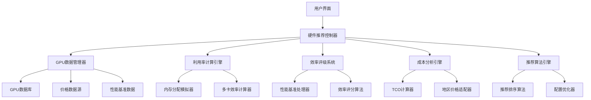

# GPU硬件推荐优化 - 设计文档

## 概述

本设计文档描述了对现有LLM内存计算工具中GPU硬件推荐功能的优化方案。通过建立更准确的GPU数据库、改进利用率计算算法、优化效率评级系统和增强成本分析功能，为用户提供更可靠、更实用的硬件推荐服务。

## 架构

### 系统架构概览



### 技术栈扩展

基于现有技术栈，新增以下组件：
- **数据验证**: Joi/Yup 用于GPU数据验证
- **数据获取**: Axios 用于外部价格API调用
- **缓存管理**: React Query 用于数据缓存和更新
- **数据处理**: Lodash 用于复杂数据操作
- **图表增强**: Chart.js 插件用于高级可视化

## 组件和接口

### 1. GPU数据管理器 (GPUDataManager)

#### 接口定义
```typescript
interface GPUDataManager {
  validateGPUData(gpu: GPUHardware): ValidationResult;
  updateGPUDatabase(updates: GPUUpdate[]): Promise<void>;
  fetchLatestPrices(region?: string): Promise<PriceUpdate[]>;
  getBenchmarkData(gpuId: string): Promise<BenchmarkData>;
  getGPURecommendations(requirements: MemoryRequirements): GPURecommendation[];
}

interface GPUHardware {
  id: string;
  name: string;
  manufacturer: 'nvidia' | 'amd' | 'intel';
  architecture: string;
  memorySize: number;           // GB
  memoryType: string;           // GDDR6X, HBM2e, etc.
  memoryBandwidth: number;      // GB/s
  computeUnits: number;         // CUDA cores, Stream processors
  baseClock: number;            // MHz
  boostClock: number;           // MHz
  tdp: number;                  // Watts
  price: PriceInfo;
  availability: AvailabilityInfo;
  efficiency: EfficiencyRating;
  benchmarks: BenchmarkData;
  lastUpdated: Date;
  dataSource: string;
  verified: boolean;
}

interface PriceInfo {
  msrp: number;                 // 官方定价
  currentPrice: number;         // 当前市场价格
  priceHistory: PricePoint[];   // 价格历史
  regionPrices: Record<string, number>; // 地区价格
  currency: string;
  lastUpdated: Date;
}

interface BenchmarkData {
  llmInference: {
    tokensPerSecond: number;
    memoryEfficiency: number;   // 0-1
    powerEfficiency: number;    // tokens/watt
  };
  llmTraining: {
    samplesPerSecond: number;
    gradientThroughput: number;
    memoryUtilization: number;
  };
  syntheticBenchmarks: {
    fp16Performance: number;    // TFLOPS
    int8Performance: number;    // TOPS
    memoryBandwidthUtilization: number;
  };
  testConditions: {
    modelSize: string;
    batchSize: number;
    sequenceLength: number;
    precision: string;
    framework: string;
  };
}
```

#### 数据验证规则
```typescript
const GPUValidationSchema = {
  memorySize: {
    min: 1,
    max: 2000,
    type: 'number',
    required: true
  },
  price: {
    msrp: { min: 100, max: 1000000 },
    currentPrice: { min: 50, max: 1500000 }
  },
  benchmarks: {
    required: ['llmInference', 'syntheticBenchmarks'],
    llmInference: {
      tokensPerSecond: { min: 1, max: 100000 }
    }
  }
};
```

### 2. 增强的利用率计算引擎 (UtilizationCalculator)

#### 核心算法改进
```typescript
interface UtilizationCalculator {
  calculateRealUtilization(
    memoryNeeded: number,
    gpuMemory: number,
    config: UtilizationConfig
  ): UtilizationResult;
  
  calculateMultiCardEfficiency(
    memoryNeeded: number,
    singleCardMemory: number,
    cardCount: number
  ): MultiCardResult;
  
  simulateMemoryFragmentation(
    allocations: MemoryAllocation[]
  ): FragmentationResult;
}

interface UtilizationConfig {
  memoryFragmentationFactor: number;    // 0.05-0.15 典型值
  systemReservedMemory: number;         // GB
  driverOverhead: number;               // GB
  safetyMargin: number;                 // 0.1-0.2
  multiCardCommunicationOverhead: number; // 0.05-0.1
}

interface UtilizationResult {
  theoreticalUtilization: number;      // 理论利用率
  practicalUtilization: number;        // 实际可用利用率
  fragmentationLoss: number;           // 碎片化损失
  systemOverhead: number;              // 系统开销
  safetyBuffer: number;                // 安全缓冲
  recommendations: string[];           // 优化建议
}

interface MultiCardResult {
  totalEffectiveMemory: number;        // 有效总内存
  communicationOverhead: number;       // 通信开销
  loadBalancingEfficiency: number;     // 负载均衡效率
  scalingFactor: number;               // 扩展因子
  optimalCardCount: number;            // 最优卡数
}
```

#### 内存分配模拟器
```typescript
class MemoryAllocationSimulator {
  simulateAllocation(
    totalMemory: number,
    allocations: AllocationRequest[]
  ): AllocationResult {
    // 模拟实际内存分配过程
    // 考虑内存对齐、碎片化等因素
    return {
      successfulAllocations: [],
      failedAllocations: [],
      fragmentationRatio: 0,
      utilizationEfficiency: 0
    };
  }
  
  predictFragmentation(
    memoryPattern: MemoryPattern
  ): FragmentationPrediction {
    // 基于历史数据预测内存碎片化程度
    return {
      expectedFragmentation: 0,
      confidence: 0,
      mitigationStrategies: []
    };
  }
}
```

### 3. 效率评级系统 (EfficiencyRatingSystem)

#### 多维度评级算法
```typescript
interface EfficiencyRatingSystem {
  calculateOverallRating(gpu: GPUHardware, workload: WorkloadType): EfficiencyRating;
  getPerformanceScore(benchmarks: BenchmarkData): PerformanceScore;
  getEfficiencyScore(gpu: GPUHardware): EfficiencyScore;
  getPowerEfficiencyScore(gpu: GPUHardware): PowerEfficiencyScore;
}

interface EfficiencyRating {
  overall: number;              // 0-100 综合评分
  performance: number;          // 性能评分
  efficiency: number;           // 效率评分
  costEffectiveness: number;    // 成本效益评分
  powerEfficiency: number;      // 功耗效率评分
  reliability: number;          // 可靠性评分
  breakdown: RatingBreakdown;
  confidence: number;           // 评分可信度
}

interface RatingBreakdown {
  computePerformance: {
    score: number;
    weight: number;
    factors: string[];
  };
  memoryPerformance: {
    score: number;
    weight: number;
    factors: string[];
  };
  powerEfficiency: {
    score: number;
    weight: number;
    factors: string[];
  };
  costEffectiveness: {
    score: number;
    weight: number;
    factors: string[];
  };
}

// 评级权重配置
const RATING_WEIGHTS = {
  inference: {
    computePerformance: 0.35,
    memoryPerformance: 0.25,
    powerEfficiency: 0.20,
    costEffectiveness: 0.20
  },
  training: {
    computePerformance: 0.40,
    memoryPerformance: 0.30,
    powerEfficiency: 0.15,
    costEffectiveness: 0.15
  }
};
```

#### 基准测试数据处理
```typescript
class BenchmarkProcessor {
  normalizeBenchmarks(
    rawBenchmarks: RawBenchmarkData[]
  ): NormalizedBenchmarks {
    // 标准化不同来源的基准测试数据
    return {
      normalizedScores: {},
      confidenceIntervals: {},
      dataQuality: 0
    };
  }
  
  calculateRelativePerformance(
    targetGPU: string,
    referenceGPU: string = 'rtx-4090'
  ): RelativePerformance {
    // 计算相对于参考GPU的性能表现
    return {
      relativeScore: 0,
      performanceRatio: 0,
      confidenceLevel: 0
    };
  }
}
```

### 4. 增强的成本分析引擎 (CostAnalysisEngine)

#### TCO计算器
```typescript
interface TCOCalculator {
  calculateTotalCostOfOwnership(
    gpu: GPUHardware,
    usage: UsageProfile,
    timeframe: number
  ): TCOResult;
  
  compareConfigurations(
    configurations: GPUConfiguration[]
  ): ConfigurationComparison;
}

interface UsageProfile {
  hoursPerDay: number;
  daysPerMonth: number;
  workloadType: 'inference' | 'training' | 'mixed';
  utilizationRate: number;      // 0-1
  electricityRate: number;      // $/kWh
  coolingOverhead: number;      // 额外散热成本系数
}

interface TCOResult {
  initialCost: number;          // 初始购买成本
  operationalCost: {
    electricity: number;        // 电费
    cooling: number;           // 散热成本
    maintenance: number;       // 维护成本
  };
  totalCost: number;           // 总成本
  costPerHour: number;         // 每小时成本
  costPerToken: number;        // 每token成本（推理）
  costPerSample: number;       // 每样本成本（训练）
  breakdownByCategory: CostBreakdown;
}

interface CostBreakdown {
  hardware: number;            // 硬件成本占比
  power: number;              // 电力成本占比
  cooling: number;            // 散热成本占比
  maintenance: number;        // 维护成本占比
  depreciation: number;       // 折旧成本占比
}
```

#### 地区价格适配器
```typescript
class RegionalPriceAdapter {
  adaptPriceToRegion(
    basePrice: number,
    targetRegion: string
  ): RegionalPrice {
    return {
      localPrice: 0,
      currency: '',
      taxRate: 0,
      importDuty: 0,
      availability: 'available' | 'limited' | 'unavailable'
    };
  }
  
  getRegionalFactors(region: string): RegionalFactors {
    return {
      priceMultiplier: 1.0,
      taxRate: 0.0,
      importDuty: 0.0,
      shippingCost: 0.0,
      warrantyDifference: 0.0
    };
  }
}
```

### 5. 智能推荐算法引擎 (RecommendationEngine)

#### 多目标优化算法
```typescript
interface RecommendationEngine {
  generateRecommendations(
    requirements: MemoryRequirements,
    constraints: RecommendationConstraints,
    preferences: UserPreferences
  ): SmartRecommendation[];
  
  optimizeConfiguration(
    baseConfig: GPUConfiguration,
    objectives: OptimizationObjectives
  ): OptimizedConfiguration;
}

interface RecommendationConstraints {
  maxBudget?: number;
  maxPowerConsumption?: number;
  maxPhysicalSize?: PhysicalConstraints;
  preferredManufacturer?: string[];
  availabilityRequirement?: 'immediate' | 'within_month' | 'flexible';
  supportRequirement?: 'enterprise' | 'community' | 'none';
}

interface UserPreferences {
  prioritizePerformance: number;    // 0-1 权重
  prioritizeCost: number;          // 0-1 权重
  prioritizePowerEfficiency: number; // 0-1 权重
  prioritizeReliability: number;   // 0-1 权重
  riskTolerance: 'conservative' | 'moderate' | 'aggressive';
}

interface SmartRecommendation extends HardwareRecommendation {
  confidenceScore: number;         // 推荐可信度
  reasoningExplanation: string[];  // 推荐理由
  alternativeOptions: AlternativeOption[];
  riskAssessment: RiskAssessment;
  futureProofing: FutureProofingScore;
}

interface AlternativeOption {
  gpu: GPUHardware;
  tradeoffs: string[];            // 权衡说明
  suitabilityScore: number;       // 适用性评分
  recommendation: string;         // 推荐说明
}
```

#### 配置优化器
```typescript
class ConfigurationOptimizer {
  findOptimalMultiCardConfig(
    memoryNeeded: number,
    availableGPUs: GPUHardware[],
    constraints: RecommendationConstraints
  ): MultiCardConfiguration {
    // 使用遗传算法或粒子群优化寻找最优多卡配置
    return {
      selectedGPU: null,
      cardCount: 0,
      totalCost: 0,
      totalMemory: 0,
      efficiency: 0,
      reasoning: []
    };
  }
  
  balancePerformanceAndCost(
    options: GPUOption[],
    preferences: UserPreferences
  ): BalancedRecommendation {
    // 在性能和成本之间找到最佳平衡点
    return {
      recommendedOption: null,
      balanceScore: 0,
      explanation: ''
    };
  }
}
```

## 数据模型

### 增强的GPU数据结构

```typescript
// 扩展现有GPU_HARDWARE常量
export const ENHANCED_GPU_HARDWARE: EnhancedGPUHardware[] = [
  {
    id: 'rtx-4090',
    name: 'RTX 4090',
    manufacturer: 'nvidia',
    architecture: 'Ada Lovelace',
    memorySize: 24,
    memoryType: 'GDDR6X',
    memoryBandwidth: 1008,        // GB/s
    computeUnits: 16384,          // CUDA cores
    baseClock: 2230,              // MHz
    boostClock: 2520,             // MHz
    tdp: 450,                     // Watts
    price: {
      msrp: 1599,
      currentPrice: 1699,
      regionPrices: {
        'US': 1699,
        'EU': 1899,
        'CN': 12999,              // CNY
        'JP': 249800              // JPY
      },
      currency: 'USD',
      lastUpdated: new Date('2024-01-15')
    },
    benchmarks: {
      llmInference: {
        tokensPerSecond: 2847,
        memoryEfficiency: 0.87,
        powerEfficiency: 6.33     // tokens/watt
      },
      llmTraining: {
        samplesPerSecond: 156,
        gradientThroughput: 1.2,
        memoryUtilization: 0.92
      },
      syntheticBenchmarks: {
        fp16Performance: 165.2,   // TFLOPS
        int8Performance: 660.8,   // TOPS
        memoryBandwidthUtilization: 0.85
      }
    },
    efficiency: {
      overall: 92,
      performance: 95,
      powerEfficiency: 88,
      costEffectiveness: 89
    },
    availability: {
      status: 'available',
      leadTime: 0,              // days
      stockLevel: 'high'
    },
    verified: true,
    lastUpdated: new Date('2024-01-15'),
    dataSource: 'manufacturer_official'
  }
  // ... 其他GPU配置
];
```

### 性能基准数据库

```typescript
export const PERFORMANCE_BENCHMARKS = {
  standardTests: {
    'llama-7b-inference': {
      testConditions: {
        modelSize: '7B',
        batchSize: 1,
        sequenceLength: 2048,
        precision: 'fp16'
      },
      results: {
        'rtx-4090': { tokensPerSecond: 2847, memoryUsage: 14.2 },
        'a100-40gb': { tokensPerSecond: 3156, memoryUsage: 14.1 },
        'h100': { tokensPerSecond: 4892, memoryUsage: 14.0 }
      }
    },
    'llama-70b-inference': {
      testConditions: {
        modelSize: '70B',
        batchSize: 1,
        sequenceLength: 2048,
        precision: 'fp16'
      },
      results: {
        'a100-80gb': { tokensPerSecond: 892, memoryUsage: 142.3 },
        'h100': { tokensPerSecond: 1456, memoryUsage: 141.8 }
      }
    }
  },
  customTests: {
    // 用户自定义基准测试结果
  }
};
```

## 错误处理

### 数据验证错误处理

```typescript
class GPUDataValidationError extends Error {
  constructor(
    message: string,
    public field: string,
    public value: any,
    public expectedRange?: { min: number; max: number }
  ) {
    super(message);
    this.name = 'GPUDataValidationError';
  }
}

class PriceDataError extends Error {
  constructor(
    message: string,
    public gpuId: string,
    public region?: string,
    public lastSuccessfulUpdate?: Date
  ) {
    super(message);
    this.name = 'PriceDataError';
  }
}

// 错误处理策略
const ERROR_HANDLING_STRATEGIES = {
  dataValidation: {
    onValidationFailure: 'use_fallback_data',
    fallbackDataSource: 'cached_data',
    retryAttempts: 3
  },
  priceDataFetch: {
    onFetchFailure: 'use_cached_price',
    cacheExpiryHours: 24,
    fallbackToMSRP: true
  },
  benchmarkDataMissing: {
    onMissingData: 'estimate_from_similar',
    similarityThreshold: 0.8,
    confidencePenalty: 0.2
  }
};
```

### 推荐系统错误处理

```typescript
interface RecommendationError {
  type: 'insufficient_data' | 'no_suitable_options' | 'calculation_error';
  message: string;
  suggestions: string[];
  fallbackRecommendations?: HardwareRecommendation[];
}

class RecommendationEngine {
  handleRecommendationError(
    error: RecommendationError,
    requirements: MemoryRequirements
  ): FallbackRecommendation {
    switch (error.type) {
      case 'insufficient_data':
        return this.generateConservativeRecommendation(requirements);
      case 'no_suitable_options':
        return this.suggestAlternativeApproaches(requirements);
      case 'calculation_error':
        return this.useSimplifiedCalculation(requirements);
    }
  }
}
```

## 测试策略

### 数据准确性测试

```typescript
describe('GPU Data Validation', () => {
  test('should validate GPU memory specifications', () => {
    const gpu = ENHANCED_GPU_HARDWARE.find(g => g.id === 'rtx-4090');
    expect(gpu.memorySize).toBe(24);
    expect(gpu.memoryBandwidth).toBeGreaterThan(800);
  });
  
  test('should validate price data freshness', () => {
    const gpu = ENHANCED_GPU_HARDWARE.find(g => g.id === 'rtx-4090');
    const daysSinceUpdate = (Date.now() - gpu.price.lastUpdated.getTime()) / (1000 * 60 * 60 * 24);
    expect(daysSinceUpdate).toBeLessThan(30); // 价格数据不超过30天
  });
});
```

### 利用率计算测试

```typescript
describe('Utilization Calculator', () => {
  test('should calculate realistic memory utilization', () => {
    const calculator = new UtilizationCalculator();
    const result = calculator.calculateRealUtilization(20, 24, DEFAULT_CONFIG);
    
    expect(result.practicalUtilization).toBeLessThan(result.theoreticalUtilization);
    expect(result.fragmentationLoss).toBeGreaterThan(0);
  });
  
  test('should handle multi-card efficiency calculation', () => {
    const calculator = new UtilizationCalculator();
    const result = calculator.calculateMultiCardEfficiency(48, 24, 2);
    
    expect(result.scalingFactor).toBeLessThan(2.0); // 不完美扩展
    expect(result.communicationOverhead).toBeGreaterThan(0);
  });
});
```

### 推荐算法测试

```typescript
describe('Recommendation Engine', () => {
  test('should provide consistent recommendations', () => {
    const engine = new RecommendationEngine();
    const requirements = { memoryNeeded: 20 * 1024 * 1024 * 1024 }; // 20GB
    
    const recommendations1 = engine.generateRecommendations(requirements, {}, {});
    const recommendations2 = engine.generateRecommendations(requirements, {}, {});
    
    expect(recommendations1[0].id).toBe(recommendations2[0].id);
  });
  
  test('should respect budget constraints', () => {
    const engine = new RecommendationEngine();
    const requirements = { memoryNeeded: 20 * 1024 * 1024 * 1024 };
    const constraints = { maxBudget: 2000 };
    
    const recommendations = engine.generateRecommendations(requirements, constraints, {});
    
    recommendations.forEach(rec => {
      expect(rec.price).toBeLessThanOrEqual(2000);
    });
  });
});
```

## 性能优化

### 数据缓存策略

```typescript
interface CacheStrategy {
  gpuData: {
    ttl: number;                // 24 hours
    invalidationTriggers: string[];
  };
  priceData: {
    ttl: number;                // 6 hours
    backgroundRefresh: boolean;
  };
  benchmarkData: {
    ttl: number;                // 7 days
    compressionEnabled: boolean;
  };
}

class DataCacheManager {
  private cache = new Map<string, CachedData>();
  
  async getCachedData<T>(
    key: string,
    fetcher: () => Promise<T>,
    ttl: number
  ): Promise<T> {
    const cached = this.cache.get(key);
    
    if (cached && Date.now() - cached.timestamp < ttl) {
      return cached.data as T;
    }
    
    const freshData = await fetcher();
    this.cache.set(key, {
      data: freshData,
      timestamp: Date.now()
    });
    
    return freshData;
  }
}
```

### 计算优化

```typescript
// 使用Web Workers进行复杂计算
class PerformanceOptimizer {
  private worker: Worker;
  
  constructor() {
    this.worker = new Worker('/workers/gpu-calculations.js');
  }
  
  async calculateRecommendations(
    requirements: MemoryRequirements
  ): Promise<HardwareRecommendation[]> {
    return new Promise((resolve) => {
      this.worker.postMessage({
        type: 'CALCULATE_RECOMMENDATIONS',
        payload: requirements
      });
      
      this.worker.onmessage = (event) => {
        if (event.data.type === 'RECOMMENDATIONS_RESULT') {
          resolve(event.data.payload);
        }
      };
    });
  }
}
```

## 部署和维护

### 数据更新流程

```typescript
interface DataUpdatePipeline {
  priceDataUpdate: {
    schedule: 'every_6_hours';
    sources: string[];
    validationRules: ValidationRule[];
  };
  benchmarkDataUpdate: {
    schedule: 'weekly';
    sources: string[];
    qualityThreshold: number;
  };
  gpuSpecUpdate: {
    schedule: 'on_demand';
    approvalRequired: boolean;
    rollbackCapability: boolean;
  };
}

class DataUpdateManager {
  async updatePriceData(): Promise<UpdateResult> {
    // 从多个数据源获取价格信息
    // 验证数据一致性
    // 更新缓存和数据库
    return { success: true, updatedCount: 0 };
  }
  
  async validateDataIntegrity(): Promise<ValidationReport> {
    // 检查数据完整性和一致性
    // 生成验证报告
    return {
      isValid: true,
      issues: [],
      recommendations: []
    };
  }
}
```

### 监控和告警

```typescript
interface MonitoringConfig {
  dataQualityMetrics: {
    priceDataFreshness: { threshold: 6, unit: 'hours' };
    benchmarkDataCompleteness: { threshold: 0.9 };
    recommendationAccuracy: { threshold: 0.85 };
  };
  performanceMetrics: {
    recommendationLatency: { threshold: 500, unit: 'ms' };
    cacheHitRate: { threshold: 0.8 };
    errorRate: { threshold: 0.01 };
  };
}

class SystemMonitor {
  checkDataQuality(): DataQualityReport {
    // 检查数据质量指标
    return {
      overallScore: 0.95,
      issues: [],
      recommendations: []
    };
  }
  
  trackPerformanceMetrics(): PerformanceReport {
    // 跟踪系统性能指标
    return {
      averageLatency: 245,
      cacheHitRate: 0.87,
      errorRate: 0.003
    };
  }
}
```

这个设计文档提供了一个全面的GPU硬件推荐优化方案，涵盖了数据管理、算法改进、用户体验优化和系统维护等各个方面。通过实施这些改进，系统将能够提供更准确、更可靠的GPU硬件推荐服务。